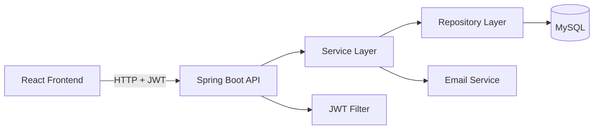

# Food Ordering Web Application

A full-stack production-ready food ordering platform with **User Panel** and **Admin Panel**, built with React + Spring Boot + MySQL.

## Project Overview

Users can browse restaurants, view menus, manage a shopping cart, place orders, and receive email notifications. Admins can manage restaurants, menu items, orders, users, and view analytics with activity logging.

## Tech Stack

| Layer | Technologies |
|-------|-------------|
| Frontend | React 18, Vite, React Router DOM, Axios, Bootstrap 5, React Toastify |
| Backend | Java 17, Spring Boot 3.2, Spring Security, JWT, Spring Data JPA, Hibernate |
| Database | MySQL 8 |
| API Docs | Swagger OpenAPI (springdoc) |
| Email | Spring Mail (Gmail SMTP) |
| Build | Maven (backend), npm (frontend) |

## Features

### User Panel
- Register, login, logout (JWT)
- Browse restaurants and menus
- Cart: add, remove, update quantity
- Place orders, cancel orders, order history
- User dashboard (profile, orders, cart summary)
- Email: registration, order confirmation, cancellation

### Admin Panel
- Login: `admin@example.com` / `admin123`
- CRUD restaurants and menu items
- Manage orders (status updates, cancel)
- View/delete users, user order history
- Dashboard analytics (users, restaurants, orders, revenue)
- Admin activity logging

## Architecture Workflow



**Layers:** Controller → Service → Repository → Entity  
**Security:** JWT Bearer token, BCrypt passwords, role-based access (`ROLE_USER`, `ROLE_ADMIN`)

## Database Design

**Database name:** `food_ordering_db`

| Entity | Relationships |
|--------|---------------|
| User | 1:1 Cart, 1:N Orders |
| Restaurant | 1:N MenuItem |
| Cart | 1:N CartItem |
| Order | 1:N OrderItem |
| AdminLog | N:1 User (admin) |

## API Endpoints

### Public
| Method | Endpoint | Description |
|--------|----------|-------------|
| POST | `/api/auth/register` | Register user |
| POST | `/api/auth/login` | Login |
| GET | `/api/restaurants` | List active restaurants |
| GET | `/api/restaurants/{id}` | Restaurant details |
| GET | `/api/menu/restaurant/{id}` | Menu by restaurant |
| GET | `/api/menu/{id}` | Menu item details |

### User (JWT required)
| Method | Endpoint | Description |
|--------|----------|-------------|
| GET | `/api/users/profile` | User profile |
| GET | `/api/users/dashboard` | User dashboard |
| GET | `/api/cart` | Get cart |
| POST | `/api/cart/add` | Add to cart |
| PUT | `/api/cart/items/{id}?quantity=` | Update quantity |
| DELETE | `/api/cart/items/{id}` | Remove item |
| POST | `/api/orders/place` | Place order |
| GET | `/api/orders` | My orders |
| PUT | `/api/orders/{id}/cancel` | Cancel order |

### Admin (JWT + ROLE_ADMIN)
| Method | Endpoint | Description |
|--------|----------|-------------|
| GET | `/api/admin/dashboard` | Analytics |
| GET | `/api/admin/logs` | Activity logs |
| CRUD | `/api/admin/restaurants` | Manage restaurants |
| CRUD | `/api/admin/menu` | Manage menu |
| GET/PUT | `/api/admin/orders` | Manage orders |
| GET/DELETE | `/api/admin/users` | Manage users |

## Setup Instructions

### Prerequisites
- Java 17+
- Maven 3.8+
- Node.js 18+
- MySQL 8+

### MySQL Setup

```sql
CREATE DATABASE IF NOT EXISTS food_ordering_db;
```

**Credentials (application.properties):**
- Username: `root`
- Password: `Aniket@123`

Tables are auto-created by Hibernate (`ddl-auto=update`). Sample data and admin user are seeded on startup via `DataInitializer`.

### Backend Setup

```bash
cd backend
mvn clean install
mvn spring-boot:run
```

Backend runs at: **http://localhost:8080**

**Swagger UI:** http://localhost:8080/swagger-ui/index.html

### Frontend Setup

```bash
cd frontend
npm install
npm run dev
```

Frontend runs at: **http://localhost:5173**

### Email Configuration (Gmail)

1. Enable 2FA on Gmail account `beinganiket07@gmail.com`
2. Create an [App Password](https://myaccount.google.com/apppasswords)
3. Set environment variable before starting backend:

```bash
# Windows PowerShell
$env:MAIL_PASSWORD="your-gmail-app-password"
mvn spring-boot:run
```

Or update `spring.mail.password` in `backend/src/main/resources/application.properties`.

## JWT Workflow

1. User logs in → receives JWT token
2. Frontend stores token in `localStorage`
3. Axios interceptor adds `Authorization: Bearer <token>` header
4. `JwtAuthenticationFilter` validates token on each request
5. Role checked for `/api/admin/**` routes

## Default Admin Account

| Field | Value |
|-------|-------|
| Email | admin@example.com |
| Password | admin123 |
| Role | ROLE_ADMIN |

## Folder Structure

```
Food ordering/
├── backend/
│   ├── pom.xml
│   └── src/main/java/com/foodordering/
│       ├── config/          # Security, CORS, Swagger, DataInitializer
│       ├── controller/      # REST controllers
│       ├── dto/             # Request/Response DTOs
│       ├── entity/          # JPA entities
│       ├── exception/       # Global exception handler
│       ├── repository/      # Spring Data JPA
│       ├── security/        # JWT, UserDetails
│       └── service/         # Business logic
│   └── src/main/resources/
│       ├── application.properties
│       ├── schema.sql
│       └── data.sql
├── frontend/
│   └── src/
│       ├── api/             # Axios & API services
│       ├── components/      # Reusable UI components
│       ├── context/         # Auth context
│       └── pages/           # Route pages (+ admin/)
└── README.md
```

## Screenshots

<!-- Add screenshots here -->
| Home | User Dashboard | Admin Panel |
|------|----------------|-------------|
|  |  |  |

## Future Enhancements

- Payment gateway integration (Stripe/Razorpay)
- Real-time order tracking with WebSockets
- Restaurant ratings and reviews
- Image upload for menu items
- Docker Compose deployment
- Unit and integration tests
- Redis caching for menus
- Multi-restaurant order splitting

## License

MIT — for educational and portfolio use.
